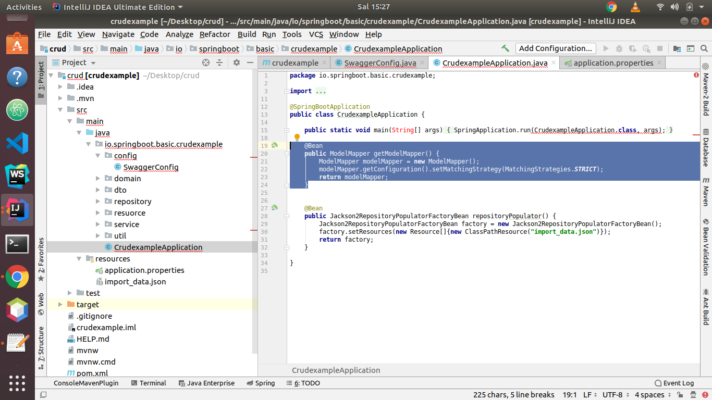

# Model Mapper



```text
    @Bean
    public ModelMapper getModelMapper() {
        ModelMapper modelMapper = new ModelMapper();
        modelMapper.getConfiguration().setMatchingStrategy(MatchingStrategies.STRICT);
        return modelMapper;
    }
```


