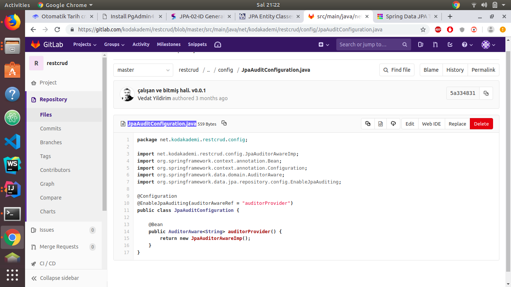
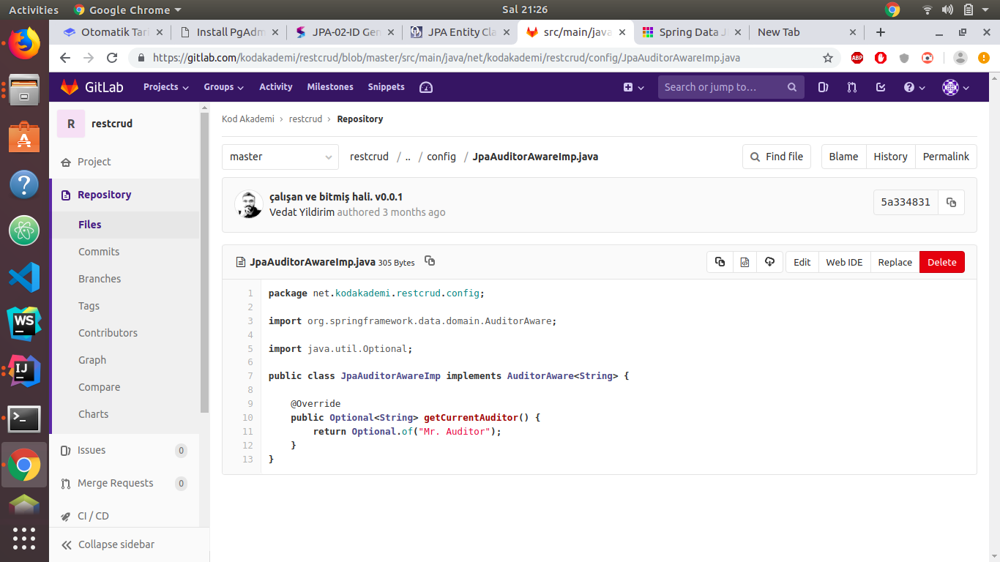

# Otomatik Tarih crateAt, updateAt..

### **1. Yöntem:** JSON format olarak aktarılır. 

```text
// JPA config içindeki ayarlara ihtiyaç duyulmadan yapılır.
@JsonFormat(pattern = "dd.MM.yyyy, HH:mm:ss")
@Column(name = "create_At", nullable = false)
private Date date = new Date();
```

### 2. Yöntem: @EntityListeners\(AuditingEntityListener.class\) notasyonuna ihtiyacınız var. Domain Katmanında örnek var.

config klasörüne iki yeni sınıf ekleriz

**JpaAuditConfiguration.java**

```text
import net.kodakademi.restcrud.config.JpaAuditorAwareImp;
import org.springframework.context.annotation.Bean;
import org.springframework.context.annotation.Configuration;
import org.springframework.data.domain.AuditorAware;
import org.springframework.data.jpa.repository.config.EnableJpaAuditing;

@Configuration
@EnableJpaAuditing(auditorAwareRef = "auditorProvider")
public class JpaAuditConfiguration {

    @Bean
    public AuditorAware<String> auditorProvider() {
        return new JpaAuditorAwareImp();
    }
}
```



```text
import org.springframework.data.domain.AuditorAware;

import java.util.Optional;

public class JpaAuditorAwareImp implements AuditorAware<String> {

    @Override
    public Optional<String> getCurrentAuditor() {
        return Optional.of("Mr. Auditor");
    }
}
```



**Entity sınıfımızda kullanım örneği aşağıdadır:**

Sınıfın başına \(üzerine\) aşağıdaki notasyon eklenir:

```text
@EntityListeners(AuditingEntityListener.class)
public class Post implements Serializable {
}
```

Kolonlarda kullanım şekli aşağıdadır:

```text
    /*@CreatedBy
    @Column(name = "created_by")
    private String createdBy;*/

    /*@CreatedDate
    @Temporal(TemporalType.TIMESTAMP)
    @Column(name = "created_at", nullable = false, updatable = false)
    private Date createdAt;*/

    /*@LastModifiedBy
    @Column(name = "modified_by", nullable = false)
    private String modifiedBy;*/

    /*@LastModifiedDate
    @Temporal(TemporalType.TIMESTAMP)
    @Column(name = "modified_at", nullable = false)
    private Date modifiedAt;*/
```

### NOT: Bunu H2 ile denediğimde çalışmadı, MySQL ve PostgreSQL'de sorun yok.

