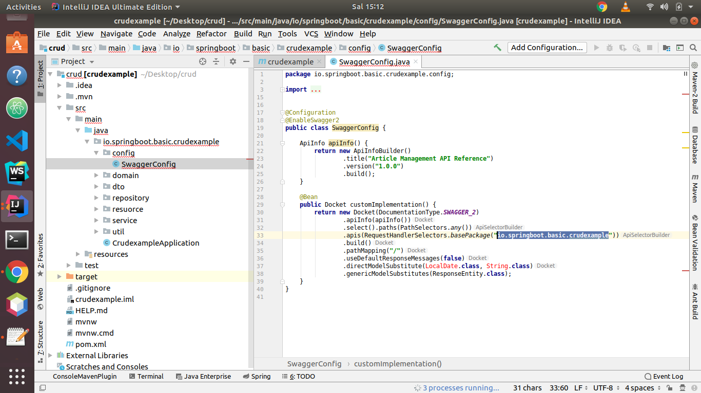

# Swagger

Projemizin içinde bir konfiruasyon klasörü ve bir sınıf oluşturur swagger'ın ayarlarını yapar, kullanıma açarız.

**Örnek:**

config/SwaggerConfig



**ApiInfoBuilder metodu altında apimizin adını ve sürümünü belirtiriz.**

**.apis içerisinde projemizin base paketini tanımlarız.**

.apis\(RequestHandlerSelectors.basePackage\("**io.springboot.basic.crudexample**"\)\)

```text
package io.springboot.basic.crudexample.config;

import org.springframework.context.annotation.Bean;
import org.springframework.context.annotation.Configuration;
import org.springframework.http.ResponseEntity;
import springfox.documentation.builders.ApiInfoBuilder;
import springfox.documentation.builders.PathSelectors;
import springfox.documentation.builders.RequestHandlerSelectors;
import springfox.documentation.service.ApiInfo;
import springfox.documentation.spi.DocumentationType;
import springfox.documentation.spring.web.plugins.Docket;
import springfox.documentation.swagger2.annotations.EnableSwagger2;

import java.time.LocalDate;


@Configuration
@EnableSwagger2
public class SwaggerConfig {

    ApiInfo apiInfo() {
        return new ApiInfoBuilder()
                .title("Article Management API Reference")
                .version("1.0.0")
                .build();
    }

    @Bean
    public Docket customImplementation() {
        return new Docket(DocumentationType.SWAGGER_2)
                .apiInfo(apiInfo())
                .select().paths(PathSelectors.any())
                .apis(RequestHandlerSelectors.basePackage("io.springboot.basic.crudexample"))
                .build()
                .pathMapping("/")
                .useDefaultResponseMessages(false)
                .directModelSubstitute(LocalDate.class, String.class)
                .genericModelSubstitutes(ResponseEntity.class);
    }
}

```

