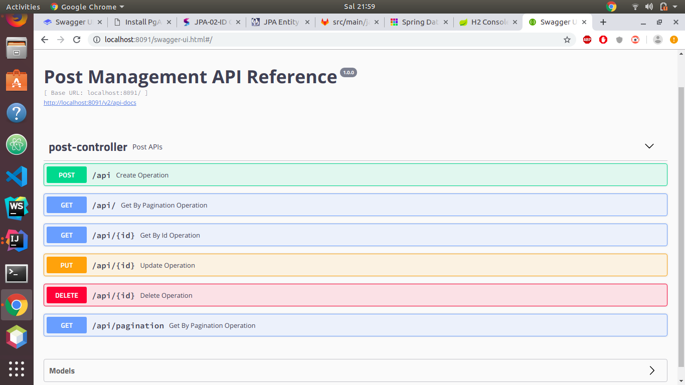

# Swagger UI - REST API Testleri



### Notlar:

_**POST:**_

_Aşağıdaki şekilde post edildiğinde:_ 

```text
{
  "author": {
    "authorId": 1
  },
  "body": "Deneme Içerik",
  "status": "DELETED",
  "title": "Deneme"
}
```

_Response olarak bu döner:_

```text
{
  "postId": 16,
  "title": "string",
  "body": "test",
  "status": "PUBLISHED",
  "author": {
    "authorId": 1,
    "uname": null,
    "name": null,
    "role": null
  }
}
```

_Ama GET edildiğinde null olan boşlukların **dolduğunu** görürsün. Kayıttan sonraki responsta böyle olması normal, sadece id'yi görüyor çünkü._



