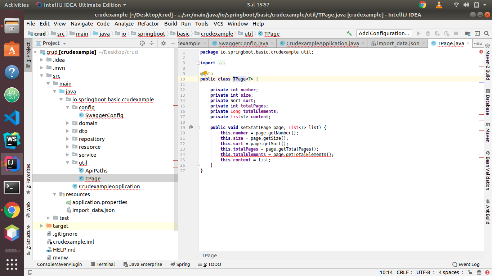
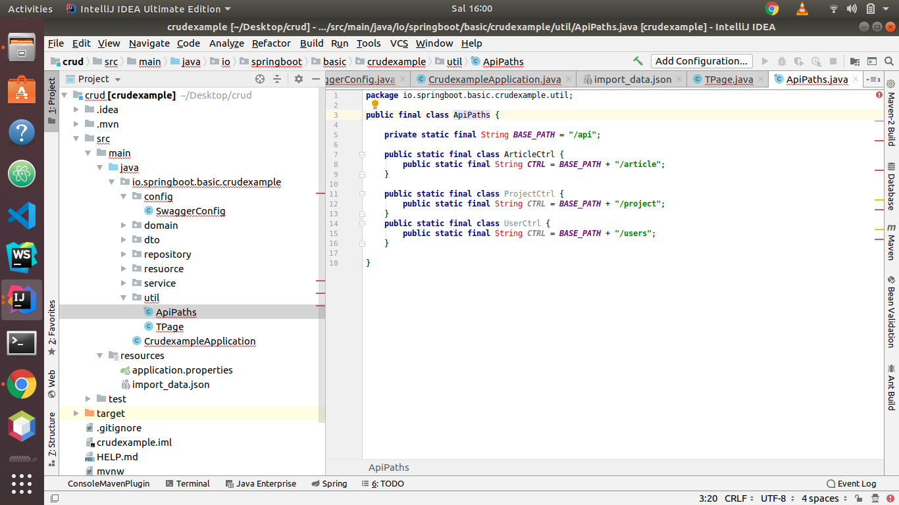

# Util Dosyası

Bu örnekte sayfalama işlemi için parametreler ve lombokun @Data notasyonu ile oluşturulan setter ve getterlar var.



util/TPage.java

```text
package io.springboot.basic.crudexample.util;

import lombok.Data;
import org.springframework.data.domain.Page;
import org.springframework.data.domain.Sort;

import java.util.List;

@Data
public class TPage<T> {

    private int number;
    private int size;
    private Sort sort;
    private int totalPages;
    private Long totalElements;
    private List<T> content;

    public void setStat(Page page, List<T> list) {
        this.number = page.getNumber();
        this.size = page.getSize();
        this.sort = page.getSort();
        this.totalPages = page.getTotalPages();
        this.totalElements = page.getTotalElements();
        this.content = list;
    }
}
```

Bu örnekte ise her yerde işimize yarayacak olan URL'lerimizi tanımlarız. Başka bir sürdü yerde kullanacağımız için değişiklik durumunda sıkıntı yaşamaz, sadece burada değiştirir ve her yerde değiştirmiş oluruz.

**BU PROJEDE YOK**

Bu isteğe bağlıdır.

util/ApiPaths.java



```text
package io.springboot.basic.crudexample.util;

public final class ApiPaths {

    private static final String BASE_PATH = "/api";

    public static final class ArticleCtrl {
        public static final String CTRL = BASE_PATH + "/article";
    }
    /*
    public static final class ProjectCtrl {
        public static final String CTRL = BASE_PATH + "/project";
    } 
    */

}
```


