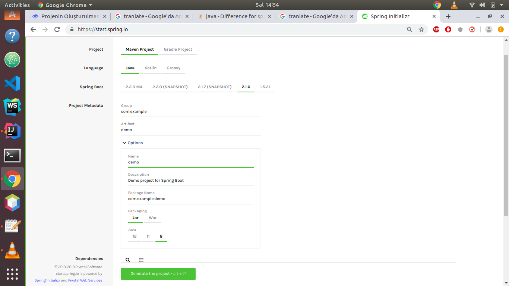
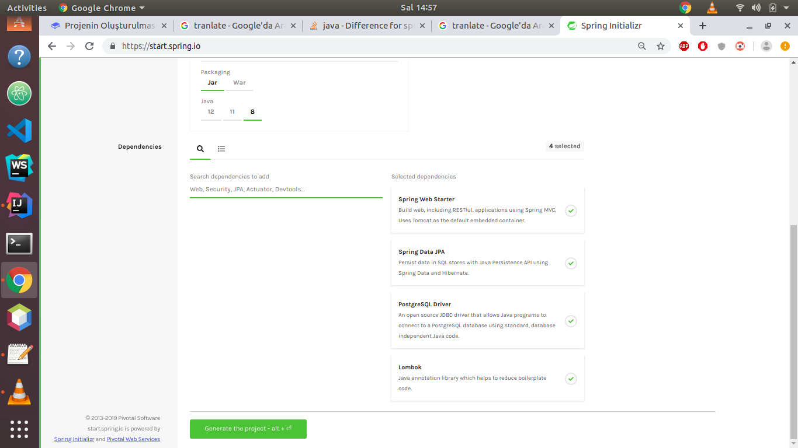

# Projenin Oluşturulması

### 1. Projeyi Oluşturma

Projenin ismini, spirng sürümünü, tipini \(jar, war\), java sürümünü, hatta java kullanmayacaksak dilini \(kotlin, groovy\) seçip, bağımlılıkları ekleme kısmına geçilir.



Proje bağımlılıklarını seçmek:

**Spring Web Starter:** İçinde gömülü tomcatle gelir. REST ve normal MVC uygulama geliştirme mimarsini ve altyapısını sunar.

**Spring Data JPA:** Veritabanı işlemleri için, ORM ve klasik JDBC ile yapılan sorgulama tirlerinin ikisini de destekler.

**Spring Data REST:** Arada hiç bir katman olmadan sadece @Entity'ler üzerinden bile CRUD işlemlerini gerçekleştirir. Ayrıca katmanları yazılmış ve path'ları tanımlanmış bir projeyi de dinler ve terminalde bütün rest url'lerini listeler.

**Lombok:** Setter, Getter, Constructor, ToString, Equels, HashCode gibi funksiyonları Notasyonlarla kullanmamızı sağlar ve kodun temiz kalmasını sağlar.

**Database Driver:** PostreSQL Driver gibi bütün diğer veri tabanlarının da driverları mevcuttur. Kullanılacak olanı seçer devam ederiz.



Bunlar dışında spring boot bünyesinde bulunmayan fakat çok yaygın kullanılan swagger\(UI tarafı için, postman gibi\) ve modelmapper\(DTO katmanı için\)'ı da pom.xml dosyamızı kendi sitelerinden veya maven websitesinden indirip projemize ekleyebiliriz. 

Burada, örnek yaptığımız için bir çok veritabanı \(mysql, postgresql ve h2\) driver'ı eklidir.

_**Örnek: pom.xml dosyasında bağımlılıkların eklenmesi**_

```text
<?xml version="1.0" encoding="UTF-8"?>
<project xmlns="http://maven.apache.org/POM/4.0.0" xmlns:xsi="http://www.w3.org/2001/XMLSchema-instance"
         xsi:schemaLocation="http://maven.apache.org/POM/4.0.0 http://maven.apache.org/xsd/maven-4.0.0.xsd">
    <modelVersion>4.0.0</modelVersion>
    <parent>
        <groupId>org.springframework.boot</groupId>
        <artifactId>spring-boot-starter-parent</artifactId>
        <version>2.1.3.RELEASE</version>
        <relativePath/> <!-- lookup parent from repository -->
    </parent>
    <groupId>com.vedatyildirim</groupId>
    <artifactId>restfulcrudexample</artifactId>
    <version>0.0.1-SNAPSHOT</version>
    <name>restfulcrudexample</name>
    <description>Spring Boot RESTful API CRUD Example</description>

    <properties>
        <java.version>1.8</java.version>
    </properties>

    <dependencies>
        <dependency>
            <groupId>org.springframework.boot</groupId>
            <artifactId>spring-boot-starter-data-jpa</artifactId>
        </dependency>
        <dependency>
            <groupId>org.springframework.boot</groupId>
            <artifactId>spring-boot-starter-data-rest</artifactId>
        </dependency>
        <dependency>
            <groupId>org.springframework.boot</groupId>
            <artifactId>spring-boot-starter-web</artifactId>
        </dependency>

        <dependency>
            <groupId>org.springframework.boot</groupId>
            <artifactId>spring-boot-devtools</artifactId>
            <scope>runtime</scope>
        </dependency>
        <dependency>
            <groupId>com.h2database</groupId>
            <artifactId>h2</artifactId>
            <scope>runtime</scope>
        </dependency>
        <dependency>
            <groupId>org.projectlombok</groupId>
            <artifactId>lombok</artifactId>
            <optional>true</optional>
        </dependency>
        <!-- https://mvnrepository.com/artifact/org.modelmapper/modelmapper -->
        <dependency>
            <groupId>org.modelmapper</groupId>
            <artifactId>modelmapper</artifactId>
            <version>2.3.2</version>
        </dependency>
        <!-- https://mvnrepository.com/artifact/io.springfox/springfox-swagger2 -->
        <dependency>
            <groupId>io.springfox</groupId>
            <artifactId>springfox-swagger2</artifactId>
            <version>2.9.2</version>
        </dependency>
        <!-- https://mvnrepository.com/artifact/io.springfox/springfox-swagger-ui -->
        <dependency>
            <groupId>io.springfox</groupId>
            <artifactId>springfox-swagger-ui</artifactId>
            <version>2.9.2</version>
        </dependency>
        <!-- https://mvnrepository.com/artifact/mysql/mysql-connector-java -->
        <dependency>
            <groupId>mysql</groupId>
            <artifactId>mysql-connector-java</artifactId>
            <version>8.0.16</version>
        </dependency>
        <dependency>
            <groupId>org.postgresql</groupId>
            <artifactId>postgresql</artifactId>
        </dependency>
        <dependency>
            <groupId>org.springframework.boot</groupId>
            <artifactId>spring-boot-starter-test</artifactId>
            <scope>test</scope>
        </dependency>
    </dependencies>

    <build>
        <plugins>
            <plugin>
                <groupId>org.springframework.boot</groupId>
                <artifactId>spring-boot-maven-plugin</artifactId>
            </plugin>
        </plugins>
    </build>

</project>
```

